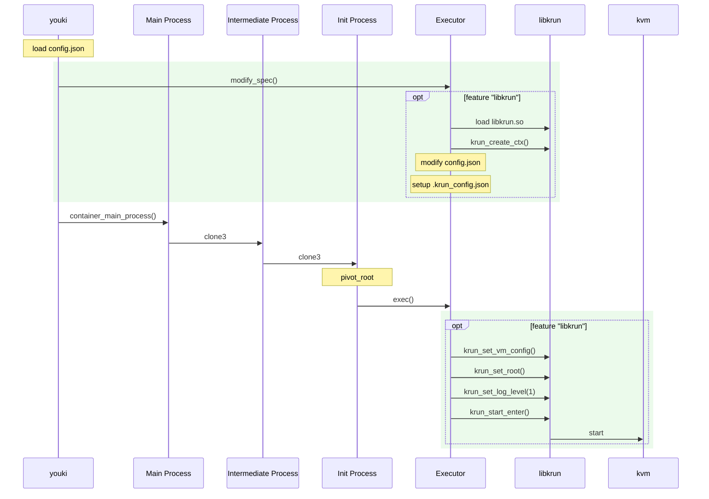

# libkrun

## Overview

This document explains how to launch VM containers using youki together with libkrun.

## Architecture

* **youki**

  * Calls the executor’s `pre_exec` during `ContainerBuilder::build`.
  * Runs the usual three processes: Main Process, Intermediate Process, and Init Process.
  * Finally, in the Init Process, calls the libkrun-specific `exec` function.

* **Executor (for libkrun)**

  * Handles only containers with the OCI annotation `run.oci.handler=krun`. For anything else, it returns `CantHandle` so the runtime can fall back.
  * `modify_spec(spec)`: pre-run preparation (load `libkrun.so`, create ctx via `krun_create_ctx`, adjust the spec, and write `.krun_config.json`).

    * This function exists because some work (reading `config.json`, and running steps that must occur **before** namespace creation and `pivot_root`) has to be done at build-time.
  * `exec(spec)`: actually starts the VM via the libkrun API (`krun_set_vm_config`, `krun_set_root`, `krun_start_enter`).

* **libkrun**

  * Boots a microVM using KVM.

# Container Creation

Steps to launch a VM-style container with **youki + libkrun**:

1. **Run youki**

   * In the OCI bundle’s `config.json`, set `annotations."run.oci.handler" = "krun"`.

2. **In libcontainer, run `InitContainerBuilder`/`TenantContainerBuilder::build`**

   * Call the executor’s `pre_exec`:

     * Executed inside `init_builder.rs` / `tenant_builder.rs` within `build`.
     * Must run **right after reading `config.json` and before `pivot_root`**.
     * Enabled via a feature flag (similar to the wasm executors).
     * Uses `can_handle` to determine eligibility.
   * Load libkrun and create the context:

     * **Load `libkrun.so` and call `krun_create_ctx()` before namespace switching and `pivot_root`**.
     * Otherwise, bundled firmware (libkrunfw) and related assets may not be found (mirrors crun’s behavior).
   * Update `config.json` to allow `/dev/kvm`:

     * If missing, add `/dev/kvm` to `linux.devices`.
     * If device cgroup restrictions exist, add an allow rule for `/dev/kvm` under `resources.devices`.
   * Duplicate `config.json` to `rootfs/.krun_config.json`:

     * `process.args` becomes the VM’s command at boot (equivalent to `krun_set_exec`).
     * For security, write directly under the rootfs safely (e.g., `openat` + `O_NOFOLLOW`).
     * Reference: [https://github.com/containers/crun/blob/02a963f9f451d217affc277efa5dcffb6afebf87/src/libcrun/handlers/krun.c#L516](https://github.com/containers/crun/blob/02a963f9f451d217affc277efa5dcffb6afebf87/src/libcrun/handlers/krun.c#L516)

3. **Create the standard process trio**

   * Spawn **Main**, **Intermediate**, and **Init** processes as usual.

4. **In the Init Process, call `executor.exec`**

   * With the `libkrun` feature enabled, run the libkrun executor (fallback on `CantHandle`).

5. **Pre-boot configuration with libkrun (inside Init)**

   * `krun_set_vm_config(ctx, vcpus, ram_mib)`: set vCPU count and RAM for the VM.
   * `krun_set_root(ctx, "/")`: set the guest OS root (since `pivot_root` has already been performed, pass `"/"`).
   * `krun_set_log_level(ctx, 1)`: configure log level (e.g., `1 = error`).

6. **Boot the VM**

   * Call `krun_start_enter(ctx)`.




## Run

kvm

```
$ lsmod | grep kvm
kvm_intel             483328  0
kvm                  1425408  1 kvm_intel
irqbypass              12288  1 kvm
```

install libkrun libkrunfw

https://github.com/containers/libkrun

https://github.com/containers/libkrunfw

```
$ ls /usr/local/lib64 | grep libkrun
libkrun.so
libkrun.so.1
libkrun.so.1.15.0
libkrunfw.so
libkrunfw.so.4
libkrunfw.so.4.10.0
```


edit config.json

```
  "annotations": {
    "run.oci.handler": "krun"
  }
```

```
$ cd crate/youki
$ LD_LIBRARY_PATH=/usr/local/lib64 cargo run --features libkrun --features systemd run -b ../../tutorial/  container
DEBUG libcontainer::user_ns: this container does NOT create a new user namespace
DEBUG youki::workload::libkrun: executing libkrun pre executer

...

DEBUG libcontainer::notify_socket: notify container start
DEBUG libcontainer::notify_socket: notify finished
DEBUG libcontainer::notify_socket: received: start container
DEBUG libcontainer::container::container: Save container status: Container { state: State { oci_version: "v1.0.2", id: "container", status: Running, pid: Some(31812), bundle: "/home/ubuntu/workspace/youki/tutorial", annotations: Some({"run.oci.handler": "krun"}), created: Some(2025-09-02T23:26:08.276279669Z), creator: Some(0), use_systemd: false, clean_up_intel_rdt_subdirectory: Some(false) }, root: "/run/youki/container" } in "/run/youki/container"
DEBUG youki::workload::libkrun: executing libkrun executer
~ # 
```

other terminal

```
$ ps aux | grep youki
root       31735  0.3  0.0  38144 14000 pts/1    S+   23:26   0:00 /home/ubuntu/workspace/youki/target/debug/youki run -b ../../tutorial/ container
root       31812  0.1  0.0 1512708 63472 ?       Ssl  23:26   0:00 /home/ubuntu/workspace/youki/target/debug/youki run -b ../../tutorial/ container
root       31981  0.0  0.0   7076  1868 pts/3    S+   23:27   0:00 grep --color=auto youki

$ pstree -p  31735
4(31735)───libkrun VM(31812)─┬─{libkrun VM}(31814)
                             ├─{libkrun VM}(31815)
                             ├─{libkrun VM}(31817)
                             ├─{libkrun VM}(31818)
                             ├─{libkrun VM}(31819)
                             ├─{libkrun VM}(31820)
                             └─{libkrun VM}(31821)
```


## TODO

* Topics beyond youki run
* Testing: enable running tests even on systems without libkrun
* Rootless containers: determine if anything additional is required
* Support:
 * SEV
 * Nitro Enclaves
 * virtio-gpu